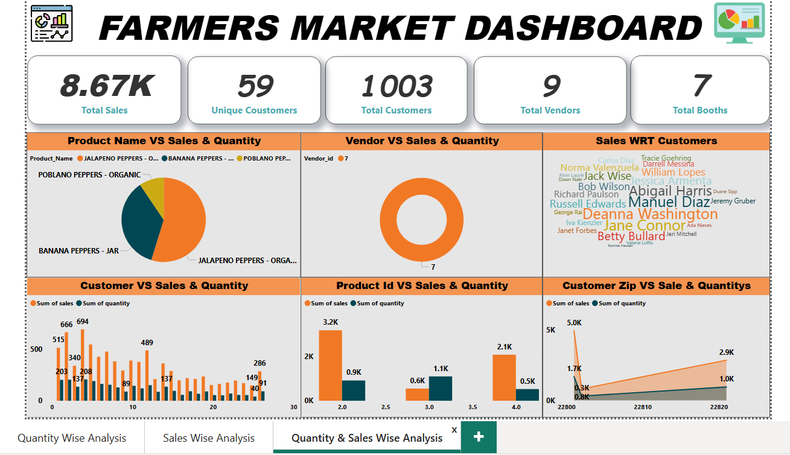

# Farmer Market Dashboard Project

## Project Overview
The Farmer Market Dashboard is a **data analysis and visualization project** designed to provide actionable insights into sales, product performance, and market trends. The dashboard helps stakeholders make informed decisions to optimize inventory, sales, and overall business performance.

## Objective
- Analyze sales data across different products and markets.
- Track sales quantity and revenue trends.
- Identify top-performing products and categories.
- Provide interactive and easy-to-understand dashboards for decision-making.

## Tools Used
- **Power BI** – for creating interactive dashboards and visualizations
- **Excel / CSV** – for raw data input and preparation
- **DAX** – for creating calculated columns and measures
- **Data Cleaning Tools** – for transforming and organizing data

## Key Features
- **Sales Analysis:** Shows total sales and sales trends over time.
- **Quantity Analysis:** Highlights product quantities sold across markets.
- **Top Products:** Displays best-selling products and categories.
- **Interactive Filters:** Users can filter by market, product, or date to see customized insights.
- **Revenue Insights:** Tracks revenue by product and market to identify high-performing areas.

## Screenshots
### Dashboard Overview

### Sales Trend Analysis

### Top Products & Quantity Analysis

*Note: Replace the paths (`screenshots/filename.png`) with your actual screenshot file paths.*

## Data Sources
- Sales data (CSV / Excel format) containing:
  - Product Name
  - Quantity Sold
  - Revenue
  - Market / City
  - Date of Sale

## Visuals Used
- Column Charts, Bar Charts, and Line Charts for trend analysis
- Pie / Donut Charts for product and category shares
- KPIs and Cards for total sales and revenue
- Interactive slicers for Market, Product, and Date

## How to Use
1. Open the dashboard in **Power BI Desktop**.
2. Use the slicers to filter data by Market, Product, or Date.
3. Click on visuals to interact and explore detailed insights.
4. Use drill-through pages for in-depth analysis of specific products or markets.

## Insights & Outcomes
- Easily identify top-selling products and markets.
- Track sales trends over time to make inventory decisions.
- Monitor quantity and revenue metrics for perform
